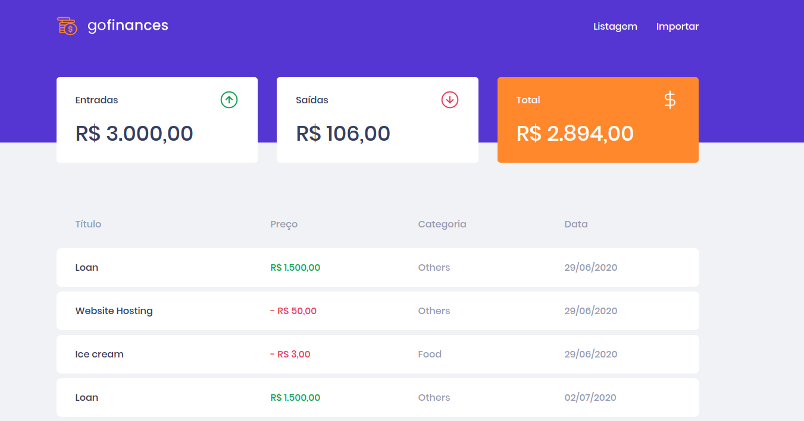
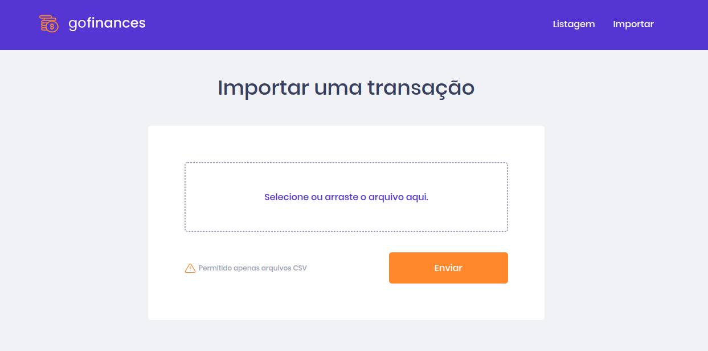

<h3 align="center">
  Front-end gofinances
</h3>

  

  

  

  

## :rocket: Sobre a aplicação

Neste aplicação foi desenvolvido a aplicação front-end da aplicação gofinances, que tem como objetivo controlar as finanças pessoais.
Repositório do back-end <a href="https://github.com/fpuntel/gostack-template-typeorm-upload">Back-end</a>

Página inicial: 

Página de importação de arquivo csv:

